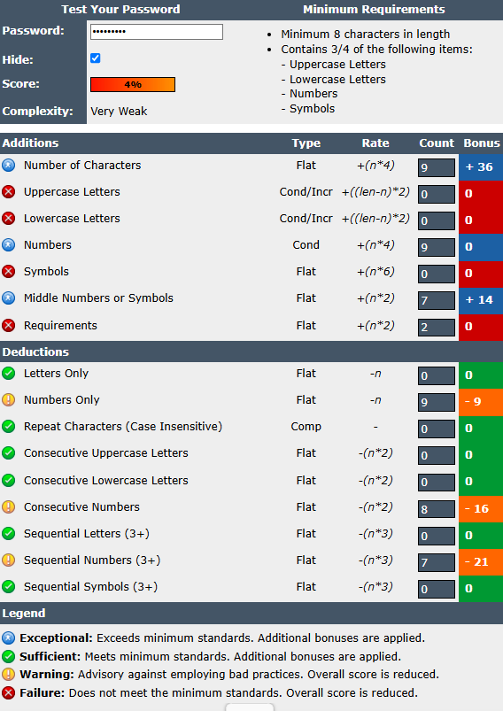
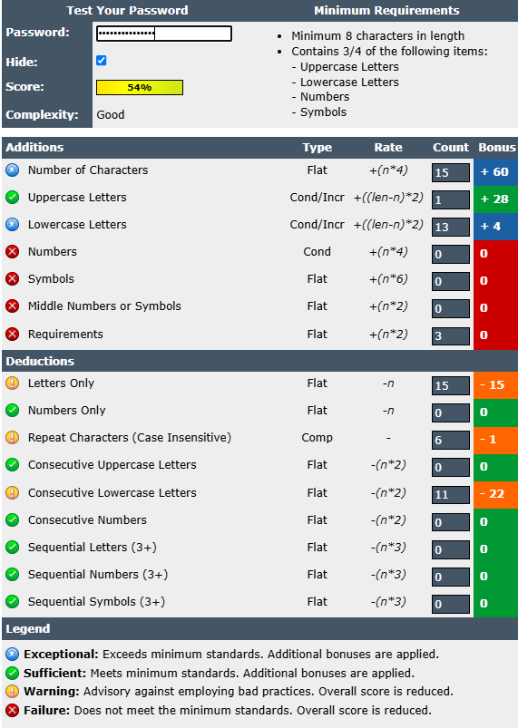

# Yash-Walhekar-Cyber-Task-6

## Password Strength Analysis Report

### Objective
This task was aimed at familiarizing with the principles of developing good passwords and testing their efficiency with the assistance of an online tool. In this report, the process of testing, results analysis and best practices of password security are documented and summarized.

### 1. Password Strength Evaluation

I generated three passwords of different degrees of complexity and analyzed them with passwordmeter.com

#### Password 1: Weak
* **Password:** `123456789`
* **Strength Score & Analysis:** The score of this password is 4% and the password is very weak. The picture of the screen displays that it just contains numbers only (Numbers Only). It fails to do this when it has deductions on Consecutive Numbers and Sequential Numbers and thus this makes it very predictable and easy to crack with basic brute force script.
* **Screenshot:**
    

#### Password 2: Medium
* **Password:** `Internship_task`
* **Strength Score & Analysis:** This is a 54% password that is rated as Good. It is very much in length (15 characters) and contains both uppercase and lower case letters. But it has absolutely no numbers and symbols, and this is the reason why it does not gain more points. The tool also deduced heavily on the consecutive letters in lower case meaning that most probably a common word or pattern was followed.
* **Screenshot:**
    

#### Password 3: Strong
* **Password:** `Internship_task_5$`
* **Strength Score & Analysis:** The score of this password is a 100 and is considered to be a very strong password. It is superb in every category: it is very long (18 characters), it contains upper and lower case letters, number and symbols. It effectively addresses every need and manages to circumvent the traps such as sequential or repeating characters that could render it quite vulnerability to assaults.
* **Screenshot:**
    

### 2. How Password Complexity Affects Security
The complexity of passwords is very important to prevent automated attack. Here's how each element helps:

* **Length:** Password length doubles exponentially and a brute force attack is not feasible against long passwords.
* **Character Variety (Uppercase, Lowercase, Numbers, Symbols):** The availability of the various types of characters also seriously widens the range of possibilities of each character in the password, increasing frustrations when it comes to brute force.

A password containing 8 characters which is weak may be broken in a couple of seconds, whereas a strong one consisting of 16 or more characters mixed with symbols may take centuries with the present day computers to crack it.

### 3. Common Password Attacks

I researched two common types of password attacks:

* **Brute Force Attack:** An automated attack that makes a systematic attempt to guess a password by combating all the possible ways of forming a password at once (e.g., repeat a, repeat a, repeat ab, etc.). This attack is suitable on short or easy passwords, however, it is not practical with long and complex passwords.
* **Dictionary Attack:** A focused attack, which involves the use of a pre-built list (a "dictionary") of popular words, expressions, and familiar leaked passwords. It is far less time consuming than a brute force attack since it does not attempt all possible combinations but only attempts likely passwords.
* **Credential Stuffing Attack:** This attack exploits a list of stolen pairs of username and passwords on one breach of data by using them to create unauthorized access to other unrelated services. It is effective, as a lot of users use the same logins keys on different web sites.
* **Password Spraying Attack:** A low and slow attack that uses one, common password (such as Password123!) in a large list of changeable user accounts. This is because this approach shuns the lockout of an individual account and this is also good in identifying users whose passwords are weak in an organization.
* **Rainbow Table Attack:** An attack on the hashes of stolen passwords, and not live logins. A rainbow table is a pre-prepared look-up file that is used to reverse compute the password hashes to the original plain-text passwords; this can be much faster than the one-by-one reverse computation of password hash to password plain-text.

### 4. Best Practices and Tips Learned
Based on the evaluation, here are the best practices for creating strong passwords and key takeaways from this task:

* **Length is Key:** Aim for at least 16 characters. The most important factor is the use of a long password.
* **Use a Mix:** Use a combination of small letters, big letters, figures, and punctuations always.
* **Avoid Personal Information:** Do not use your name, birthday, and other guessable things.
* **Use Passphrases:** Use a long, memorable and unique passphrase (from a random combination of words) which is easy to remember and difficult to guess, which makes it hard to infiltrate a computer.
* **Unique Passwords for Every Account:** Always use different passwords across different services.
* **Enable Multi-Factor Authentication (MFA):** This gives a second level of security that is critical.
* **Use a Password Manager:** The tools assist in creating and saving complicated and distinctive passwords to all your accounts without any harm.
